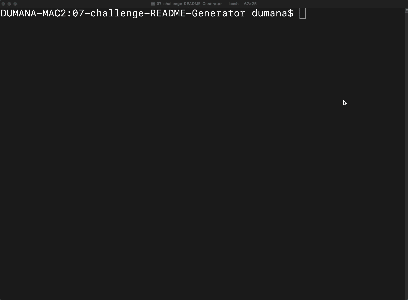
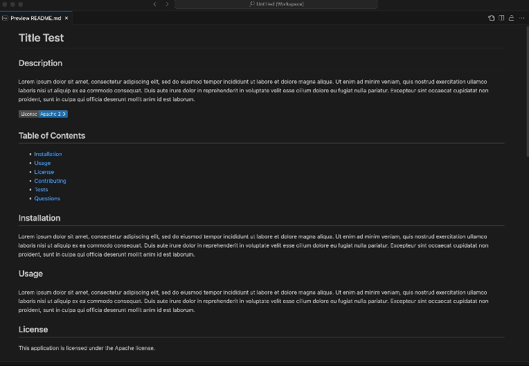

# README Generator

## Description

Want to create a quality README.md? With this application, you can use the command line to do just that. Like magic, you'll get a quality README.md after answering a few questions!

## Table of Contents

- [Installation](#installation)
- [Usage](#usage)
- [License](#license)
- [Contributing](#contributing)
- [Tests](#tests)
- [Questions](#questions)

## Installation

1. Save the repository code to your computer
2. Install npm on your computer
3. Install both npm inquirer and colors packages
4. Run using node index.js

## Usage

Command Line

README.md Generated

The generated file will be stored in the out folder

Application Walkthrough
[https://watch.screencastify.com/v/odm8HZJBpTwLH2CG2KHe](https://watch.screencastify.com/v/odm8HZJBpTwLH2CG2KHe)

## License

MIT License

Copyright (c) 2024 David Umana

Permission is hereby granted, free of charge, to any person obtaining a copy
of this software and associated documentation files (the "Software"), to deal
in the Software without restriction, including without limitation the rights
to use, copy, modify, merge, publish, distribute, sublicense, and/or sell
copies of the Software, and to permit persons to whom the Software is
furnished to do so, subject to the following conditions:

The above copyright notice and this permission notice shall be included in all
copies or substantial portions of the Software.

THE SOFTWARE IS PROVIDED "AS IS", WITHOUT WARRANTY OF ANY KIND, EXPRESS OR
IMPLIED, INCLUDING BUT NOT LIMITED TO THE WARRANTIES OF MERCHANTABILITY,
FITNESS FOR A PARTICULAR PURPOSE AND NONINFRINGEMENT. IN NO EVENT SHALL THE
AUTHORS OR COPYRIGHT HOLDERS BE LIABLE FOR ANY CLAIM, DAMAGES OR OTHER
LIABILITY, WHETHER IN AN ACTION OF CONTRACT, TORT OR OTHERWISE, ARISING FROM,
OUT OF OR IN CONNECTION WITH THE SOFTWARE OR THE USE OR OTHER DEALINGS IN THE
SOFTWARE.

## Contributing

I am open to any feedback and improvements that others may have!

## Tests

- A successful message will be displayed on the command line if a README.md has been generated.
- A README.md that has been generated should include the follow sections
  - Project Title
  - Description
  - Table of Contents
  - Installation
  - Usage
  - License
  - Contributing
  - Tests
  - Questions
- The Table of Contents should link to the relevant section
- A badge should be displayed below the Description section if a License was selected

## Authors and acknowledgment

Badge information was pulled from [https://gist.github.com/lukas-h/2a5d00690736b4c3a7ba](https://gist.github.com/lukas-h/2a5d00690736b4c3a7ba)

## Questions

For any questions, please contact me using the information below:

GitHub: [DevUmana](https://github.com/DevUmana)

Email: [dumana92@gmail.com](mailto:dumana92@gmail.com)
